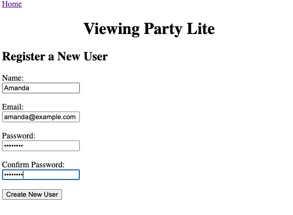
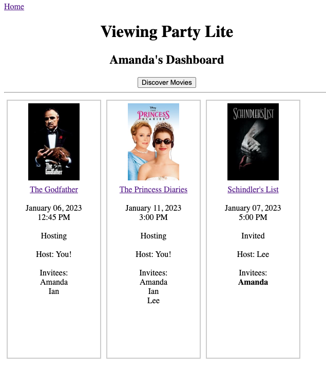
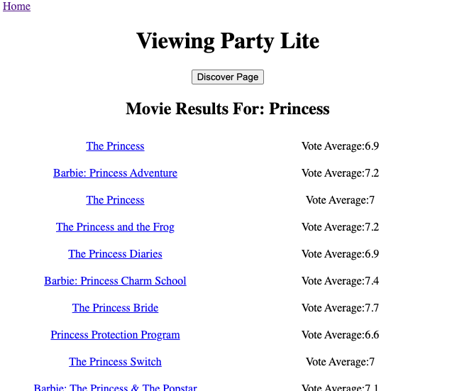
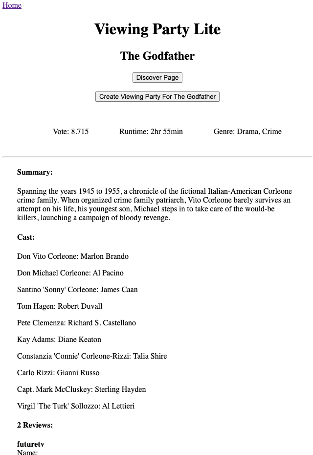
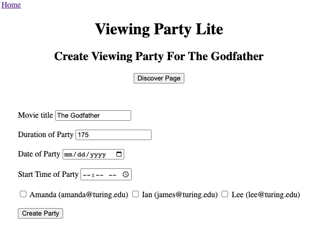

# Viewing Party
> Viewing Party is an application in which users can explore movie options and create a viewing party event for themselves and other users of the application.

##### The technical goals of this project include:
* Consume JSON APIs which require authenticiation, including tests for all facades, poros, and services.
* Organization and refactoring of code for maintainability and readability.
* Implement user authentication - utilize users login credentials, encrypted password digest, and sessions. 

##### Versions
* Ruby 2.7.4
* Rails 5.2.6

## Usage example

Register as a user or login to view your dashboard:

Discover movies by rating or keyword search:

View movie details and create your own viewing party:

_For more examples of usage, please refer to the [Project Requirements](https://backend.turing.edu/module3/projects/viewing_party_lite)._

## Development setup
* Fork and clone this repository.
* CD into the directory and run `bundle install`.
* Run `rails db:{drop,create,migrate}`.
* Visit [The Movie Database](https://developers.themoviedb.org/3/getting-started/introduction) and register for an API key.
* `touch config/application.yml` and add `tmdb_key: "<YOUR API KEY>"` to the file and save. 
* To run the testing suite, run `bundle exec rspec`.

## Meta

Amanda R. – [amikaross](https://github.com/amikaross) on Github – contact me at: amikaross@gmail.com

[Viewing Party Lite project](https://backend.turing.edu/module3/projects/viewing_party_lite) for [Turing School's](https://turing.edu/) Module 3

<!-- Markdown link & img dfn's -->
[npm-image]: https://img.shields.io/npm/v/datadog-metrics.svg?style=flat-square
[npm-url]: https://npmjs.org/package/datadog-metrics
[npm-downloads]: https://img.shields.io/npm/dm/datadog-metrics.svg?style=flat-square
[travis-image]: https://img.shields.io/travis/dbader/node-datadog-metrics/master.svg?style=flat-square
[travis-url]: https://travis-ci.org/dbader/node-datadog-metrics
[wiki]: https://github.com/yourname/yourproject/wiki
